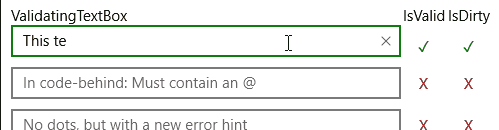

# UWP Reusables

##Controls

###ValidatingTextBox



A text box that validates all input, and displays error messages if any of the validation functions fail.

Can be used in XAML:

```XAML
  <vtb:ValidatingTextBox PlaceholderText="No dots or exclamations allowed.">
            <vtb:ValidationPair ErrorMessage="No dots allowed." ValidationFunction="{x:Bind NoDotsFunction}"/>
            <vtb:ValidationPair ErrorMessage="Exclamation marks not allowed either >:|" ValidationFunction="{x:Bind NoExclamationsFunction}"/>
 </vtb:ValidatingTextBox>
```

and the validation functions bound to are simply defined in code-behind as follows:

```C# 	
public Func<string, bool> NoDotsFunction { get; set; } = NoDotsFunctionImpl;
public Func<string, bool> NoExclamationsFunction { get; set; } = NoExclamationsImpl;

private static bool NoDotsFunctionImpl(string input)
{
    if (input.Contains("."))
    {
        return false;
    }
    else
    {
        return true;
    }
}

private static bool NoExclamationsImpl(string arg)
{
    if (arg.Contains("!"))
    {
        return false;
    }
    else
    {
        return true;
    }
}
```

Note that the validation functions are pure, static functions, and could be defined anywhere; your ViewModel, a PCL, whatever.

Can also be defined in code-behind:
   
```C# 
string locallyScopedString = "closures work just fine";
ValidatingTextBox codeBehindBox = new ValidatingTextBox();
codeBehindBox.ValidationPairs.Add(new ValidationPair
{
    ValidationFunction = s => s.Contains("@"),
    ErrorMessage = $"Gotta have at least one @ here. And {locallyScopedString}!",                
});   
```       

###ValidatingTextBoxPortable

The portable version of the above ValidatingTextBox. This sacrifices usability in favor of portability. The ValidatingTextBox requires that
any part of the program that defines validation functions know about the ValidationPair class, and requires a reference to the ValidatingTextBox project.
The ValidatingTextBoxPortable, however, allows validating functions to be defined without needing that reference. The tradeoff is that the syntax is slightly less friendly.

In XAML: 

```XAML
<validation:ValidatingTextBoxPortable PlaceholderText="No dots or exclamations" 
									  ValidationFunctions="{x:Bind TopBoxValidationFunctions}">
```

And the `TopBoxValidationFunctions` is an `IList<Func<string, string>>`--that is, a List of Functions that take in a string as input, and return a string. It might be defined as follows:

```C#
public IList<Func<string, string>> TopBoxValidationFunctions => new List<Func<string, string>>
{
	input => input.Contains("!") ? "No shouting! Exclamations aren't allowed." : null,
    input => input.Contains(".") ? "Can't be having none of them dots, either." : null
};
```

...and those validation functions treat `null` return values as validation successes, and non-null values are treated as validation failures, with the returned string being interpreted as the error message for that validation function.

###InlineFormatter

The InlineFormatter attached propertes allow binding formatted text strings (e.g. "<format>This <bold>text</bold> <underline>has</underline> <italic>formatting</italic>!</format>") as XAML TextBlock content. The feature is implemented by parsing the input string using the platform XML parser and assigning the resulting Inline tree to TextBlock.Inlines.

You might be asking what is the point of such behaviour: in XAML, we can always anyway construct the corresponding Inline tree in code and directly assign it to the target TextBlock. Well, this might be a good idea as long as you never have to localize your app. However, as soon as you start sourcing your UI strings from a localization file, you will most definitely want to specify the logical structure of the formatting in your translated strings. This is not possible by using vanilla bindings, because you can't do anything like <TextBlock Inlines="{x:Bind MyLocalizedFormatString}" /> (<TextBlock Text="{x:Bind MyLocalizedSimpleString}" /> works, because Text expects a string).

The formatting can be anything supported by XAML Inlines, and you can define your own custom formatter in code, including adding inline links with arbirtrary click handlers. The default formatter only supports mapping the Bold, Underline and Italic tags 1:1. See the TestBed for examples.

This code was inspired by and improved from http://stackoverflow.com/questions/5565885/how-to-bind-a-textblock-to-a-resource-containing-formatted-text
